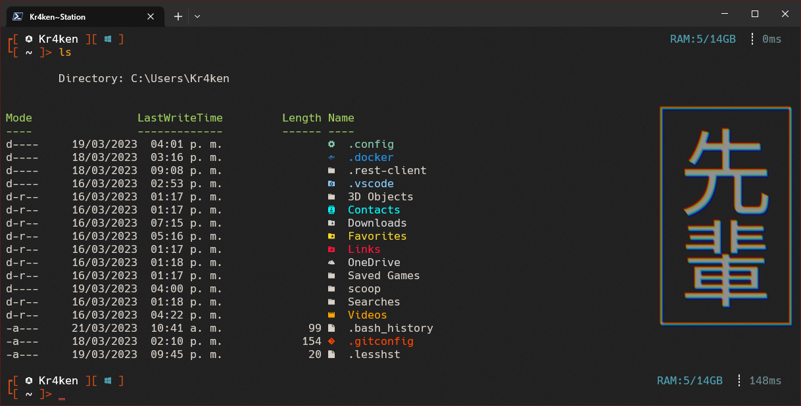
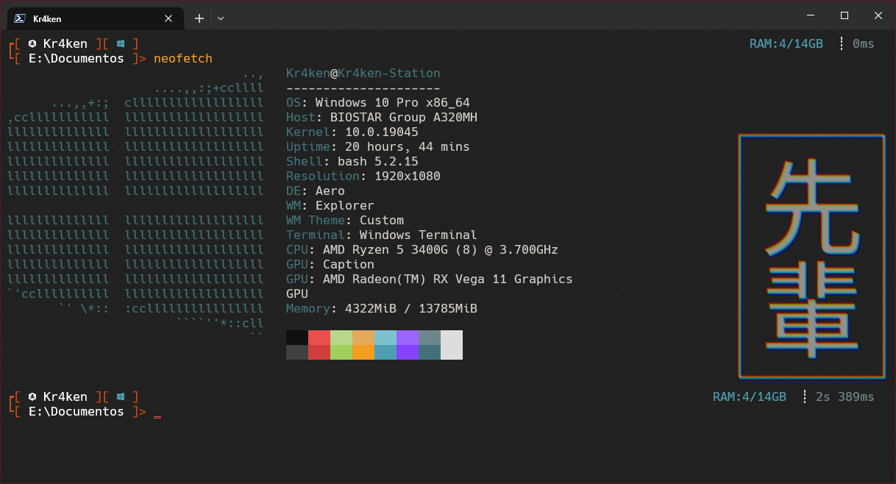

# Tema 👺 Japanese-Style 👺 - Oh my posh

Tema de **[Oh My Posh](https://ohmyposh.dev/)** y configuración para **[Windows Terminal](https://www.microsoft.com/store/productId/9N0DX20HK701)**

# Screenshots



# Instrucciones de instalacion
Instalar **[Windows Terminal](https://www.microsoft.com/store/productId/9N0DX20HK701)**, ya que es una terminal más personalizable.

Instalar la **[PowerShell](https://www.microsoft.com/store/productId/9MZ1SNWT0N5D)** de la Microsoft Store

Instalar **[Oh My Posh](https://ohmyposh.dev/)**
```
winget install JanDeDobbeleer.OhMyPosh -s winget
```
>Para mas información revisar la documentacion en la pagina oficical

Instalar **[Terminal-Icons](https://github.com/devblackops/Terminal-Icons)**
```
Install-Module -Name Terminal-Icons -Repository PSGallery
```
>Para mas información revisar el repositorio oficial

Descargar e instalar la fuente **[Hack Nerd Font Mono](https://www.nerdfonts.com/font-downloads)**

Copiar y remplazar el archivo **Microsoft.PowerShell_profile.ps1** en la ruta: ```C:\Users\%USER%\Documents\PowerShell```

Entrar en la carpeta **Theme** y copiar el archivo **japanese-style.omp.json** en la ruta: ```C:\Users\%USER%\AppData\Local\Programs\oh-my-posh\themes```

Copiar todos los archivos de la carpeta Settings en la ruta: ```C:\Users\%USER%\AppData\Local\Packages\Microsoft.WindowsTerminal_8wekyb3d8bbwe\LocalState```

>Remplazar %USER% por tu nombre de usuario real

Por último reiniciamos la terminal y escribimos:
```
. $PROFILE
```

# Algunos Keyboard Shortcuts

|    | COMBINACIÓN TECLAS      | DESCRIPCIÓN                                |
| -: |-------------------------|--------------------------------------------|
| 1  | ctrl + shift + f        | Abre la opción de búsqueda                 |
| 2  | ctrl + shift + "        | Divide un panel hacia abajo                |
| 3  | ctrl + shift + ?        | Divide un panel hacia la izquierda         |
| 4  | ctrl + shift + x        | Enfoca el panel                            |
| 5  | ctrl + shift + z        | Cierra el panel                            |
| 6  | ctrl + shift + up       | Cambia el enfoque al panel superior        |
| 7  | ctrl + shift + down     | Cambia el enfoque al panel inferior        |
| 8  | ctrl + shift + left     | Cambia el enfoque al panel izquierdo       |
| 9  | ctrl + shift + right    | Cambia el enfoque al panel derecho         |
| 10 | alt + shift + up        | Redimensiona el panel hacia arriba         |
| 11 | alt + shift + down      | Redimensiona el panel hacia abajo          |
| 12 | alt + shift + left      | Redimensiona el panel hacia la izquierda   |
| 13 | alt + shift + right     | Redimensiona el panel hacia la derecha     |
